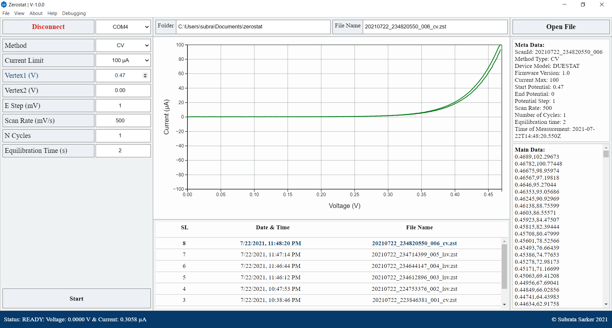

# ZEROSTAT

## A GUI app for Arduino-based potentiostat





## Quick Start & Build
-----------------------------
```sh
git clone https://github.com/picklu/zerostat
cd zerostat
npm install
npm run dev
```

```sh
npm run build:windows
npm run postinstall
```

```sh
npm run dist:windows
npm run postinstall
```

## License
-----------------------------
MIT
